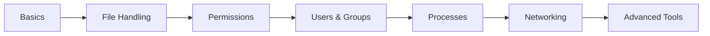

Here’s your **🔥 ULTRA PREMIUM COMPLETE GitHub README.md (Class 01 → Class 06)**
Structured like a **top-tier DevOps course repo** with clean sections, visuals, and professional formatting 👇

---

# 🐧 Linux Mastery Series (Class 01 – Class 06)

<p align="center">
  <b>🚀 From Beginner to System-Level Understanding</b><br>
  <i>Hands-on | DevOps Focused | Real-World Ready</i>
</p>

<p align="center">
  
  
  
</p>

---

# 📚 Course Roadmap



---

# 📅 Class Breakdown

| Class    | Topic                            |
| -------- | -------------------------------- |
| Class 01 | File Handling + VI               |
| Class 02 | Redirect, Copy, Move, Grep       |
| Class 03 | Users, Permissions, Architecture |
| Class 04 | Text Processing (sed, awk, cut)  |
| Class 05 | SSH, SCP, Links                  |
| Class 06 | Process, Services, Networking    |

---

# 🧑‍🏫 CLASS 01 — Linux Basics

## 📁 File Creation

```bash
touch <file_name>
touch f1 f2 f3
clear
```

---

## 📂 Listing

```bash
ls
ls -l
ls -lt
ls -lrt
ls -lrth
```

---

## 📁 Directory

```bash
mkdir dir
cd dir
cd ..
cd
```

---

## 📍 Current Directory

```bash
pwd
```

---

## ❌ Delete

```bash
rm file
rm -rf dir
rm *
rm -rf *
```

⚠️ **Critical Command:** `rm -rf *`

---

## ✍️ VI Editor

```bash
vi file
i          # insert
Esc :wq!   # save & quit
Esc :q!    # quit
```

---

## 🔍 Replace

```bash
:%s/old/new/ig
```

---

## 🖨️ Echo

```bash
echo "hello"
echo -e "line1 \nline2"
```

---

## 🧪 Assignment

```bash
tac file.txt
```

---

# 🧑‍🏫 CLASS 02 — File Operations

## 🔁 Redirect

```bash
echo "hello" > file
echo "world" >> file
```

---

## 📄 Copy

```bash
cp f1 f2
cp f1 dir/
cp -R dir1 dir2
```

---

## 🚚 Move

```bash
mv f1 f2
mv f1 dir/
```

---

## 📊 Word Count

```bash
wc file
wc -l file
wc -w file
wc -c file
```

---

## 🔍 Grep

```bash
grep word file
grep -i word file
grep -v word file
grep -c word file
```

---

# 🧑‍🏫 CLASS 03 — Permissions & Users

## 🔐 Permissions

```text
r = 4
w = 2
x = 1
```

```bash
chmod 777 file
chmod 644 file
chmod u+rwx file
chmod g+rw file
```

---

## 👤 Users

```bash
useradd user
passwd user
userdel user
```

---

## 👥 Groups

```bash
groupadd grp
usermod -aG grp user
```

---

## 🔑 Sudo

```bash
sudo su -
```

---

## 🧠 Architecture

```text
Hardware → Kernel → Shell → Application → User
```

---

# 🧑‍🏫 CLASS 04 — Text Processing

## 📄 Head / Tail

```bash
head -5 file
tail -5 file
```

---

## 🔗 Pipe

```bash
command1 | command2
```

---

## ✏️ sed

```bash
sed 's/old/new/g' file
sed -i '2d' file
```

---

## ✂️ cut

```bash
cut -d " " -f1 file
```

---

## 🧠 awk

```bash
awk '{print $1}' file
awk 'NR==2' file
```

---

## 🌳 tree

```bash
tree
```

---

## 🔍 find

```bash
find -type f -name file
find -mtime -5
find -empty
```

---

# 🧑‍🏫 CLASS 05 — Networking & Transfer

## 🔗 Links

```bash
ln file hardlink
ln -s file softlink
```

---

## 🔐 SSH

```bash
ssh user@ip
ssh -i key.pem user@ip
```

---

## 📂 SCP

```bash
scp file user@ip:/path
```

---

## ⚡ rsync

```bash
rsync -avz dir user@ip:/path
```

---

## 🌐 Ports

| Service | Port |
| ------- | ---- |
| SSH     | 22   |
| HTTP    | 80   |
| HTTPS   | 443  |
| FTP     | 21   |

---

# 🧑‍🏫 CLASS 06 — Process & System

## ⚙️ Process

```bash
ps -ef
top
kill -9 PID
```

---

## 🔧 Services

```bash
systemctl start docker
systemctl stop docker
systemctl enable docker
```

---

## 📊 System Info

```bash
free -h
df -h
nproc
uptime
```

---

## 🌐 Network

```bash
netstat -tulnp
ping google.com
```

---

## 🧠 Advanced

```bash
history
alias ll="ls -l"
export VAR="value"
```

---

## 🔁 Background Jobs

```bash
command &
jobs
fg %1
```

---

## 🕒 Time

```bash
timedatectl
date
```

---

# 🧪 Assignments (Important)

### 🧩 Practice Tasks

* List block volumes
* Sticky bit
* Create sudo user
* Check last login
* Extend password expiry
* Install Tomcat
* Find large files
* Delete empty files
* Learn telnet, screen
* Zombie process
* IP blocking

---

# 💡 Pro Tips

```text
⚡ Tab → Auto-complete
⬆️ Arrow → History
🚀 Practice → Mastery
```

---

# 🏆 Real DevOps Insight

> “Linux is not a subject.
> It is a survival skill in DevOps.”

---

# 🚀 Next Level Topics

* Shell Scripting 🧠
* Cron Jobs ⏰
* Log Management 📜
* Monitoring 📊

---

# ⭐ Final Motivation

<p align="center">
  <b>“The more you practice Linux, the less you fear production issues.”</b>
</p>

---

## 🔥 Want More?

I can upgrade this into:

* 🎯 **PPT with animations**
* 🎥 **YouTube course content**
* 🧑‍🏫 **Teaching script (story-based)**
* 🧪 **Interview questions + answers**

Just say: **“make pro DevOps course pack”** 🚀
