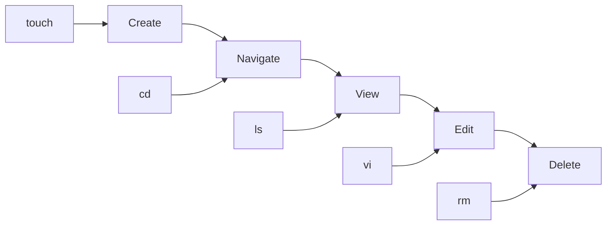

Here’s your **🔥 ULTRA PREMIUM GitHub README.md** — styled like top DevOps repos with badges, visuals, structure, and pro-level polish 👇

---

# 🐧 Linux Basics - Class 01

<p align="center">
  <b>🚀 Learn Linux the Practical Way — Step by Step</b><br>
  <i>Hands-on | Beginner Friendly | DevOps Ready</i>
</p>

<p align="center">
  
  
  
  
</p>

---

## 📅 Session Info

* 🗓 Date: **30-03-2026**
* 🎯 Topic: **Linux Fundamentals**
* 👨‍🏫 Mode: **Hands-on Training**

---

## 🧠 Learning Flow



---

## 📚 Table of Contents

| 📌 Topic                | 🔗 Link                                 |
| ----------------------- | --------------------------------------- |
| 📁 File Creation        | [Jump](#-file-creation)                 |
| 📂 Listing Files        | [Jump](#-listing-files--directories)    |
| 📁 Directory Management | [Jump](#-directory-management)          |
| 📍 Current Directory    | [Jump](#-current-directory)             |
| ❌ Deletion              | [Jump](#-deleting-files--directories)   |
| ✍️ VI Editor            | [Jump](#️-vi-text-editor)               |
| 🔍 Find & Replace       | [Jump](#-find-and-replace-in-vi-editor) |
| 🖨️ Print               | [Jump](#️-print-in-linux)               |
| 🧪 Practice Lab         | [Jump](#-practice-lab)                  |
| 📝 Assignment           | [Jump](#-assignment)                    |

---

## 📁 File Creation

```bash
# Create files
touch <file_name>
touch f1
touch f2 f3 f4
```

```bash
# Clear terminal
clear
```

---

## 📂 Listing Files & Directories

```bash
ls        # List files & directories
ls -l     # Long format
ls -lt    # Sort by time
ls -lrt   # Reverse order
ls -lrth  # Human readable size
```

📌 **Pro Insight:**
Use `ls -lrth` daily — it’s the most practical combo.

---

## 📁 Directory Management

```bash
# Create directory
mkdir <directory_name>
mkdir sagar
mkdir test test1 test2
```

```bash
# Navigate
cd <directory_name>
cd sagar
```

```bash
# Move back
cd ..

# Go to home
cd
```

---

## 📍 Current Directory

```bash
pwd   # Present Working Directory
```

---

## ❌ Deleting Files & Directories

```bash
rm <file_name>
rm f1
rm f2 f3 f5
```

```bash
rm -rf <directory_name>
rm -rf sagar
rm -rf test test1
```

---

### ⚠️ Danger Zone

```bash
rm *        # Delete all files
rm -rf *    # Delete EVERYTHING

rm *.c      # Delete .c files
rm *.txt    # Delete .txt files
```

<p align="center">
  ⚠️ <b>Think twice before using rm -rf *</b>
</p>

---

## ✍️ VI Text Editor

```bash
vi <file_name>
```

---

### 🔹 Modes

| Mode  | Action       |
| ----- | ------------ |
| `i`   | Insert Mode  |
| `Esc` | Command Mode |

---

### 💾 Save & Exit

```bash
Esc + :wq!   # Save & Quit
Esc + :w     # Save
Esc + :q!    # Quit without saving
```

---

### 📄 File View

```bash
cat <file_name>
```

---

### ⚙️ Useful Commands

```bash
Esc + u          # Undo
Esc + :set nu    # Show line numbers
Esc + :set nonu  # Hide line numbers
Esc + :4         # Go to line 4
Esc + dd         # Delete line
```

---

## 🔍 Find and Replace in VI Editor

```bash
:%s/<old>/<new>/ig
```

---

### 🧩 Breakdown

| Symbol | Meaning          |
| ------ | ---------------- |
| `%`    | Entire file      |
| `s`    | Substitute       |
| `g`    | Global           |
| `i`    | Case insensitive |

---

### ⚡ Advanced Examples

```bash
:%s/old/new/ig
:2s/old/new/ig
:2,3s/old/new/ig
:2,$s/old/new/ig
:2s/old/new/ig | 5s/old/new/ig
```

---

## 🖨️ Print in Linux

```bash
echo "welcome to ss training"
```

```text
welcome to ss training
```

---

### 📌 Multi-line Output

```bash
echo -e "welcome \nss training"
```

```text
welcome
ss training
```

---

## 🧪 Practice Lab (🔥 Must Try)

```bash
# Step 1
touch file1 file2 file3

# Step 2
mkdir demo

# Step 3
cd demo

# Step 4
touch test.txt

# Step 5
ls -lrt

# Step 6
cd ..

# Step 7
rm file1
```

---

## 🧪 Mini Challenge

```bash
🔥 Try this:
- Create 5 files
- Create 2 directories
- Navigate inside
- Delete selectively
```

---

## 📝 Assignment

🎯 **Display file content in reverse order**

```bash
Hint: tac <file_name>
```

---

## 💡 Pro Tips

```text
⚡ Tab → Auto-complete
⬆️ Arrow → Previous command
🚀 Practice → Mastery
```

---

## 🏆 Real-World Tip

> In DevOps, speed matters.
> The faster you navigate Linux, the better engineer you become.

---

## 🌐 Connect & Resources

* 📂 GitHub Repo: *(Add your repo link here)*
* 🎥 YouTube: *(Add your channel link)*

---

## ⭐ Motivation

<p align="center">
  <b>"Linux is not learned by reading — it is mastered by doing."</b>
</p>

---

## 🚀 Next Class Preview

➡️ File Permissions
➡️ Ownership
➡️ chmod / chown

---
